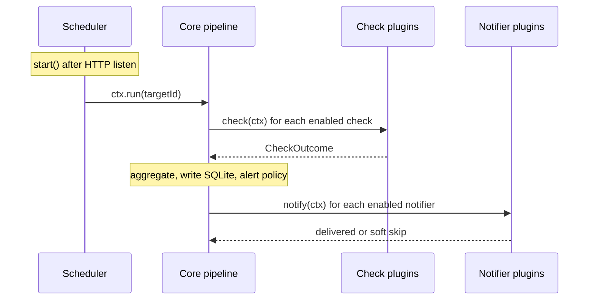

# Chapter 1 — Framework overview

[← Guide index](README.md) · [Next: Contracts →](02-contracts.md)

## Core vs plugins

Core is the **host**. Plugins are the **workers**.

| Responsibility | Owner |
|----------------|-------|
| HTTP API, UI shell, SQLite | Core |
| Load plugins from `plugins.json` | Core |
| Runtime enable/disable (plugin manager) | Core |
| Run checks → record results → apply alert policy → call notifiers | Core |
| Decide *whether* to alert (`state_change`, `every_fail`, `throttle`) | Core |
| Per-target check/notifier allowlists | Core |
| Probe the target | **Check plugin** |
| Decide *when* to run a target | **Scheduler plugin** |
| Deliver an alert core already decided to send | **Notifier plugin** |

Core never probes a URL, never decides *when* to probe, and never sends a push or webhook. Plugins never store monitoring history and never decide *whether* an alert should fire.

Plugins run **in-process** with API privileges. Only load code you trust.

## Mental model

```text
plugins/                → check / notify / scheduler / auth implementations
plugins.json            → which modules load (process-wide pool; singular auth slot)
plugin-manager.json     → which loaded plugins are enabled at runtime
targets[]               → what to watch (url, interval, enabled, group)
target.check_ids        → which enabled checks run ([] = all enabled)
target.notifier_ids     → which enabled notifiers get alerts ([] = all enabled)
target_notifier_configs → per-target notifier overrides; core field check_ids
scheduler               → when to call core run(targetId)
core pipeline           → checks → record SQLite → alert policy → notifiers
```

Frozen core tables (plugins must not `ALTER`): `groups`, `targets`, `settings`, `check_results`, `target_state`, `target_check_configs`, `target_notifier_configs`.

Plugin-owned settings (destinations, extra config) live in **sidecar files** next to the database and are edited through `registerRoutes` + UI — not `.env`.

## How core talks to plugins

Core and plugins do not import each other. Core calls hooks; plugins answer or call back through a tiny context.



1. **Load** — Core reads `plugins.json` and dynamically imports modules from `plugins/<kind>/<id>/`. Loaded ≠ enabled.
2. **Start the clock** — After the API is listening, core calls the scheduler's `start()`. After every target create, update, delete, or Pause, core calls `reschedule()`.
3. **Scheduler asks core to run** — When a target is due, the scheduler calls `ctx.run(targetId)`. That is the only way a check cycle starts.
4. **Core asks checks to probe** — Core filters by plugin manager enable + target `check_ids` + optional `evaluateTarget`, then calls `check(ctx)` on each. The plugin returns `{ ok, statusCode, error, latencyMs }` and stops.
5. **Core keeps the books** — Core aggregates outcomes, writes SQLite, and applies alert policy.
6. **Core asks notifiers to deliver** — If policy says alert, core applies each notifier's per-target **`check_ids`** allowlist, then calls `notify(ctx)`.

Plugin HTTP and UI are a **side channel** for plugin-owned data. They are not how probes run or how alerts fire.

## Startup sequence

```text
initCore(DB)
  → initPlugins()           # load checks, notifiers, scheduler, auth
  → auth.bootstrap()        # when auth plugin enabled (e.g. rbac admin seed)
  → registerAuthGate()      # delegate to auth plugin or anonymous admin
  → register core HTTP routes + auth.registerRoutes()
  → mountAllPluginRoutes()  # /api/plugins/<kind>/<id>/…
  → app.listen()
  → scheduler.start()
```

Implementation: [`api/src/index.ts`](../../api/src/index.ts), [`api/src/plugins/registry.ts`](../../api/src/plugins/registry.ts).

## Plugin discovery

The loader ([`registry.ts`](../../api/src/plugins/registry.ts)):

1. Reads [`api/plugins.json`](../../api/plugins.json) (override with `PLUGINS_CONFIG`).
2. Resolves files under repo `plugins/` (override with `PLUGINS_ROOT`):
   - `plugins/<kind>/<id>/index.{ts,js,mjs}`
   - `plugins/<kind>/<id>.{ts,js,mjs}`
3. Dynamic `import()` the module.
4. Picks export from `default`, `plugin`, or the module object.
5. Runs runtime type guards (`isCheckPlugin`, `isSchedulerPlugin`, `isNotifierPlugin`).
6. Asserts exported `plugin.id === plugins.json` id.
7. For notifiers: calls optional `init()`; load failures are logged but do not crash startup.

## File layout

```text
plugins/<kind>/<id>/
  index.ts          # required — export default (or `plugin`)
  README.md         # recommended — usage + developer notes
  config.ts         # optional — sidecar read/write, normalization
  routes.ts         # optional — HTTP routes
  send.ts           # optional — delivery logic (notifiers)
  ui/
    index.tsx       # optional — PluginUiModule (check/notify/scheduler) or AuthPluginUiModule (auth)
    Page.tsx        # optional — React page
  mobile/           # optional — AuthPluginUiModule for Expo (auth plugins only)
    index.tsx
```

Auth plugins use `ui/` and `mobile/` for Settings panels (not nav routes). See [Chapter 6 — Auth plugin UI](06-routes-and-ui.md#auth-plugin-ui).

```text
plugins/auth/<id>/
  index.ts          # required — AuthPlugin export
  gate.ts           # resolvePrincipal + evaluateAccess
  routes.ts         # login, users, roles, tokens
  ui/index.tsx      # optional — web Settings panels
  mobile/index.tsx  # optional — mobile Settings panels
```

Single-file plugins also work: `plugins/<kind>/<id>.ts`.

The API TypeScript build **excludes** plugin UI paths ([`api/tsconfig.json`](../../api/tsconfig.json)). Web plugin UI is typechecked by the web build; auth mobile UI by the mobile app (`mobile/tsconfig.json` includes `../plugins/auth/*/mobile/**/*`).

## Three plugin kinds

| Kind | Folder | Cardinality | Job |
|------|--------|-------------|-----|
| Check | `plugins/check/<id>/` | One or more | Probe and return ok/fail |
| Scheduler | `plugins/scheduler/<id>/` | **Exactly one** | Decide when to call `ctx.run()` |
| Notifier | `plugins/notify/<id>/` | Zero or more | Deliver alerts |

Default shipped set: `http` check, `interval` scheduler, `webhook` notifier. Other notifiers ship loaded but disabled until **Settings → Plugin manager**.

Most plugin work is **checks** and **notifiers**. Do not replace the `interval` scheduler unless you need a different kind of clock (cron, business hours, global tick). Change how often a target runs with its `interval_seconds` in the UI.

## Allowlists (core-owned)

Both `check_ids` and `notifier_ids` are JSON arrays on each target.

| Value | Meaning |
|-------|---------|
| `[]` | Run/notify via **all enabled** plugins of that kind |
| `["http"]` | Only that plugin if loaded **and** enabled |

Ids that are not loaded, or loaded but disabled in the plugin manager, stay in the DB but are skipped at run time.

Notifiers also have a **check allowlist** in `target_notifier_configs.check_ids` — core applies this before calling `notify()`. Plugins must **not** reimplement this filter.

## Aggregation rules

After selected checks finish:

| Outcomes | Status |
|----------|--------|
| All `ok: true` | `up` |
| All `ok: false` | `down` |
| Mix | `partial` |

Recorded `latency_ms` is the **max** of individual `latencyMs` values. Failures are prefixed with `[pluginId]` and joined with `; `.
